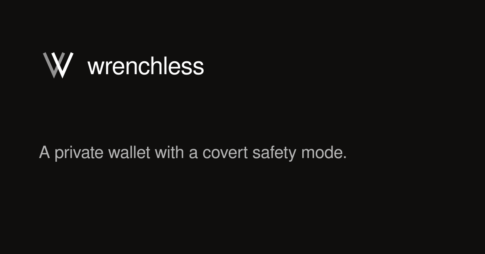

<p align="center">
  
</p>

# Wrenchless

A passkey-protected trip allowance for shielded assets on Starknet.

[Open Wrenchless](https://wrenchless.timidan.xyz) · [Mainnet contract](https://voyager.online/contract/0x018f6925422c85da8c9e0c1572adf4316a9821ffabc4b29db37d11c6a0c2844a) · [Transaction evidence](strk20.json)

## What it does

Wrenchless keeps most of a private balance parked while making a chosen amount
available each day. Missed days accumulate. The remainder stays locked until
the return date.

- Shielded STRK and USDC
- Daily or single-release plans
- Top-ups and return-date extensions
- Passkey protection and recovery words

| Park most | Use the allowance | Bring back the rest |
| --- | --- | --- |
|  |  |  |

## How it works

1. Connect Ready.
2. Choose an asset, allowance, and return date.
3. Save the recovery words and confirm the private transaction.
4. Release what is available or return the remainder when the trip ends.

Ready supplies the private balance, proof, and signature. The Wrenchless
contract enforces the schedule. Funds remain inside the STRK20 flow.

## Privacy boundary

| Hidden by STRK20 | Visible on Starknet |
| --- | --- |
| Wallet balance, private note ownership, sender-to-recipient link | Token, parked amount, schedule, contract status |

The encrypted Safe ticket stays in the browser. Wrenchless stores no user
profile, wallet balance, recovery words, or activity history on a server.

## Mainnet evidence

The deployed Travel Safe v2 proves the complete private FUND → CLAIM lifecycle.
The daily-allowance v3 helper is implemented on this branch and is not yet
configured in production.

- Travel Safe v2: [`0x018f...2844a`](https://voyager.online/contract/0x018f6925422c85da8c9e0c1572adf4316a9821ffabc4b29db37d11c6a0c2844a)
- STRK20 pool: [`0x0403...e812a`](https://voyager.online/contract/0x040337b1af3c663e86e333bab5a4b28da8d4652a15a69beee2b677776ffe812a)
- FUND: [`0x0c4f...13a6`](https://voyager.online/tx/0x0c4fbacb5ee5fd3a65f09d7a724ad585387ba642e570a11ed79f9be8ac013a6)
- CLAIM: [`0x02e9...788e`](https://voyager.online/tx/0x02e969f712d5ff8f3091bd42b06978c285c8ad221081da5f575afbc72f87888e)
- Machine-readable record: [`strk20.json`](strk20.json)

## Architecture

```text
Browser + passkey
     ├─ Ready: private balance, proof, signature
     └─ Sponsor relay → Travel Safe helper → STRK20 pool
```

- `apps/hub` — React web app
- `apps/sponsor` — bounded transaction relay
- `contracts/refill-helper` — immutable Cairo helpers
- `packages/canary-core` — shared actions, tickets, and recovery logic

## Run locally

Requirements: Node.js 22, pnpm 11, and a WalletConnect project ID for mobile.

```bash
pnpm install
cp apps/hub/.env.example apps/hub/.env.local
pnpm hub:dev
```

Set `VITE_WALLETCONNECT_PROJECT_ID` in `apps/hub/.env.local`. To run the sponsor:

```bash
WRENCHLESS_SPONSOR_ENV=/absolute/path/sponsor.env pnpm sponsor:dev
```

## Verify

```bash
pnpm test
pnpm typecheck
pnpm contracts:test
```

These commands do not broadcast transactions.

## License

[MIT](LICENSE)
